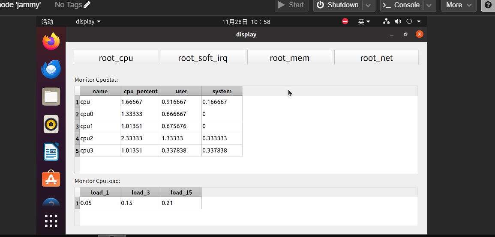
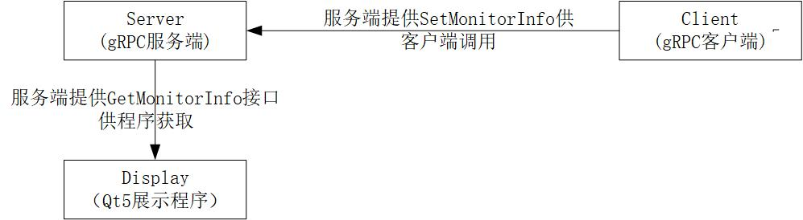
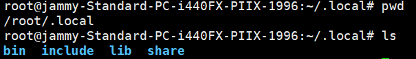

# 项目简介

基于系统的运行状态和性能瓶颈开发的linux性能监控工具。该项目包含多个模块，能够监控 CPU 负载、内存使用、网络流量等系统性能指标，并通过图形界面展示监控结果。


# 项目结构展示
项目通过模块化处理进行解耦，从下图可以看到项目分成了三块，即数据源(client)、数据中心(server)、用于展示的客户端(display)。模块化处理后，后续的迭代更新会更方便，例如当需要把gRPC模块替换成自研的gRPC，仅需要替换server以及client，其它模块不用动。

# 编译安装流程

项目在Ubuntu20.04系统下使用cmake进行编译构建，具体版本信息如下：
g++ (Ubuntu 9.4.0-1ubuntu1~20.04.2) 9.4.0
项目使用到的技术包括gRPC,protoBuffer,Qt5等等，在编译前需要安装相关依赖
关于gRPC部分的安装可参考[gRPC官方文档](https://grpc.io/docs/languages/cpp/quickstart/)，依据文档流程操作完毕后，可以在.local中看到gRPC的目录结构如下


```cmake
#ubuntu下Qt5模块的安装
apt install qt5-default
#请替换proto下的CMakeLists.txt中第一行的gRPC安装地址，方便cmake寻找gRPC
#list(APPEND CMAKE_PREFIX_PATH "/root/.local/lib/cmake")

#编译代码
cmake -S . -B build
cmake --build build

#运行程序
#直接使用项目运行脚本，该脚本会启动一个gRPC服务端，一个用于设置Linux性能信息的gRPC客户端和一个用于展示Qt程序
/bin/bash auto_start.sh
```


